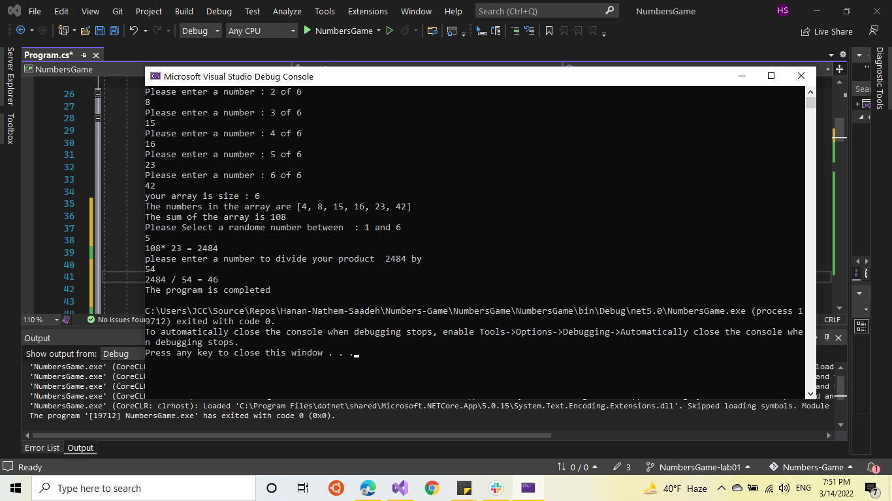

# Lab: 01a - Numbers Game

##  setting up this program.

1. clone this repo in visual studio (VS).
2. start depuging (press f5) .
3. insert the numbers depends the insructions that will show to you 

## purpose of the program
- create a math game that takes user input, manipulates data, and utilizes error handling.
- It's a math game , like the user fill an array , then the program show the user , the array size and elements of the array and sum of elements .
- compute mathmatical Equation and applying some operation on array.
---
## How do I run the program?
- The program will ask the user to enter array size and the elements of the array .
- ask the user to insert random number between a range.
- ask the user to insert a number to devide the product.
---
## What does the program look like? (visual)

